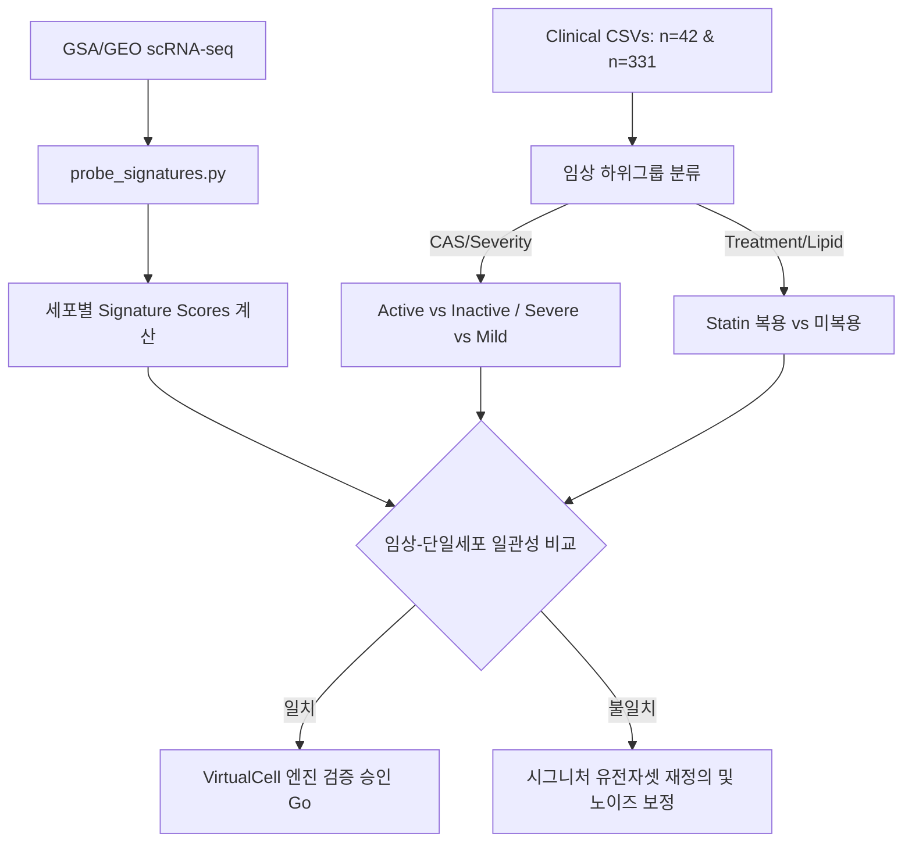

# M1 · 임상 앵커 정의서 (Clinical Validation Anchors)

> **목적:** VirtualCell_TGFb1 엔진의 시뮬레이션 결과와 시그니처 점수를 로컬에서 보유한 실제 환자 코호트 데이터와 비교/교정(calibration)하여, 모델의 임상적 예측 타당성을 확보합니다.
> **작성일:** 2026-06-10

본 레포지토리 내에 존재하며 검증용 앵커로 활용될 로컬 임상 데이터셋의 구조와 역할은 다음과 같습니다.

---

## 1. 순환 Fibrocyte 프로파일 (`Fibrocytes/Fibrocytes ver1.02.csv`)

순환 피브로사이트(Fibrocytes)는 골수 유래 세포(CD45+, CD34+, Collagen I+)로, 안와 조직으로 이동하여 TGFβ 등의 자극 하에 myofibroblast로 분화하여 섬유화를 유도하는 핵심 세포군입니다.

### 1.1 데이터 명세 (n = 42 Patient Profiles)
- **임상 지표:** 성별/연령, 흡연 여부, 활동성 점수(`CAS`, `CASgroup`), 스테로이드 치료이력 및 용량(`Steroid`, `SteroidDose`), 방사선 치료 여부(`RTx`), 안와감압술 여부(`Decom`), TSHRab, TSH, fT4, WBC.
- **피브로사이트 분석 (flow cytometry):** 
  - `FibroT1`, `FibroT2`: 타임포인트 1, 2에서의 피브로사이트 분율.
  - `CD4534Col1`: CD45+/CD34+/Col-I+ 트리플 양성 세포 수.
  - `TSHR`, `IGFR`, `CXCR`: 피브로사이트 상의 수용체 발현도.

### 1.2 단일세포 시그니처 매핑 & 검증 가설
- **TGFβ 유도 myofibroblast 분화 축 검증:**
  - **가설:** 순환 피브로사이트 비율 및 수용체 발현 수준이 높은 환자군일수록, 안와 조직 scRNA-seq 데이터에서 Fibroblast의 `myofibroblast` 시그니처 점수와 `tgfb_signaling` 시그니처 점수가 동반 상승할 것이다.
  - **시그니처 점수 대응:** `probe_signatures.py`에서 계산하는 `score_myofibroblast` 및 `score_tgfb_signaling` 임계값 설정에 활용.

---

## 2. 대규모 TED 임상 및 이상지질혈증 코호트 (`TED_Dyslipidemia/TED_Dys1.3.csv`)

안와 fibroblasts는 adipogenesis(지방생성) 경로를 밟는 lipofibroblast와, fibrosis(섬유화) 경로를 밟는 myofibroblast 간의 상호 배타적 분화 기전을 가집니다. 환자의 전신 지질 프로파일과 statin 사용 이력은 이 균형에 영향을 미칠 수 있습니다.

### 2.1 데이터 명세 (n = 331 Patient Profiles)
- **지질 프로파일:** 총콜레스테롤(`TC`), LDL-C(`LDLC`), HDL-C(`HDLC`), 중성지방(`TG`), 지질 비율(`TcHR`, `TgHR`, `LHR`), 스타틴 복용력(`StatinHx`).
- **중증도 및 활동성:** `CASscore` (0~7), 복시(`DONyn`), 근육침범(`CTmuscleinvolve`), EUGOGO 분류(`EUGOGO`), 안구돌출도(`Exophthalmos`, `Exodiff`).
- **전신 염증 마커:** WBC, 호중구/림프구 비율(`NLR`), 단핵구(`Monocyte`), 혈소판(`Platelet`), ESR.

### 2.2 단일세포 시그니처 매핑 & 검증 가설
- **Adipogenesis vs. Myofibroblast 균형 검증:**
  - **가설:** 스타틴 복용군(`StatinHx = 1`) 혹은 이상지질혈증 조절 환자군은 orbital fibroblast의 `adipogenesis_lipofibroblast` (RASD1, PPARG 등) 점수와 `myofibroblast` 점수 비율에서 차이를 보일 것이다. 스타틴은 TGFβ 유도성 myofibroblast 분화를 억제하는 경향이 있으므로, 스타틴 복용 이력은 조직 내 myofibroblast 활성 점수 억제와 음의 상관관계를 가져야 한다.
  - **염증성 활성 대응:** 전신 염증 지표(`NLR`, `ESR`)가 높은 환자군은 scRNA-seq 상의 `inflammation_active` 점수(IFNG, IL6, TNF 등)의 상승과 매핑됩니다.

---

## 3. 임상-단일세포 데이터 통합 검증 워크플로우

### 3.1 세부 실행 규칙
1. **임상 그룹핑 기반 검정:**
   - 임상 데이터의 `CASscore >= 3` (Active) vs `CASscore < 3` (Inactive) 환자군에서 전신 염증(`NLR`) 및 피브로사이트 분율(`FibroT1`)의 통계적 차이를 확인합니다.
   - 이 차이가 scRNA-seq 상의 `inflammation_active` 및 `tgfb_signaling` 점수 분포 차이(MWU Test Effect Size)와 경향성(Directionality) 면에서 일치하는지 모니터링합니다.
2. **시뮬레이션 예시적 교정 (Illustrative Calibration):**
   - in silico 시뮬레이션 엔진이 예측하는 fibroblast-to-myofibroblast 전이 확률은 `Fibrocytes ver1.02.csv` 코호트의 `CD4534Col1` 피브로사이트 분포를 하드웨어적인 경계 조건(boundary conditions)으로 직접 주입하여 엔진을 하드 튜닝하는 대신, 외부에서 결과 분포의 경향성을 시각적으로 대조하고 검정하는 독립적인 예시적 교정(illustrative calibration) 모델로만 활용합니다. 이는 소규모 임상 코호트의 선택 편향(selection bias)이 핵심 시뮬레이션 물리 엔진 내부로 누수되어 하드코딩되는 것을 철저히 경계하기 위함입니다 (헌장: bias 누수 경계).
